<!-- Auto-generated by generate_readme.py - do not edit README.md directly -->

  

 

## 💻 Tech Stack

 

## 📊 GitHub Stats

  

 

---

## 🚀 What I'm Working On

  <h4>🔹 <a href="https://github.com/dacrab/wallpapers">wallpapers</a> </h4>
  
Optimized Nord-themed wallpaper collection (1080p, WebP format)

  <h4>🔹 <a href="https://github.com/dacrab/mybash">mybash</a> ⭐ 1</h4>
  
My Bash profile - Highly customized Starship Theme - Just imagine Powerlevel1...

  <h4>🔹 <a href="https://github.com/dacrab/reddit-gallery-dl">reddit-gallery-dl</a> </h4>
  
A high-performance Reddit Gallery Downloader written in Go (Golang). Streams ...

  <h4>🔹 <a href="https://github.com/dacrab/dragon-blaze">dragon-blaze</a> ⭐ 2</h4>
  
2D action platformer built with Unity 6 featuring fluid movement, combat syst...

 

## 🌱 Latest Projects

  <h4>🔹 <a href="https://github.com/dacrab/wallpapers"><strong>wallpapers</strong></a></h4>
  
Optimized Nord-themed wallpaper collection (1080p, WebP format)

  

  <h4>🔹 <a href="https://github.com/dacrab/reddit-gallery-dl"><strong>reddit-gallery-dl</strong></a></h4>
  
A high-performance Reddit Gallery Downloader written in Go (Golang). Streams downloads on-the-fly...

  
<code>HTML</code>

  <h4>🔹 <a href="https://github.com/dacrab/recipeswap-v2"><strong>recipeswap-v2</strong></a></h4>
  
A premium full-stack recipe platform built with Astro 5, React, and Cloudflare. Features social i...

  
<code>Astro</code>

 

## 🔨 Recent Contributions

  
🔀 <a href="https://github.com/dacrab/dragon-blaze/pull/1"><strong>Refactor/architecture and player</strong></a> 
  in <a href="https://github.com/dacrab/dragon-blaze">dacrab/dragon-blaze</a>

  
🔀 <a href="https://github.com/vicinaehq/vicinae/pull/808"><strong>feat: add COPR packaging and automation for vicinae</strong></a> 
  in <a href="https://github.com/vicinaehq/vicinae">vicinaehq/vicinae</a>

  
❌ <a href="https://github.com/victrme/Bonjourr/pull/728"><strong>feat: add duplicate link feature</strong></a> 
  in <a href="https://github.com/victrme/Bonjourr">victrme/Bonjourr</a>

  
❌ <a href="https://github.com/victrme/Bonjourr/pull/727"><strong>Auto-switch to imperial units based on user locale</strong></a> 
  in <a href="https://github.com/victrme/Bonjourr">victrme/Bonjourr</a>

  
❌ <a href="https://github.com/victrme/Bonjourr/pull/726"><strong>Add line break support in quotes for poems and multi-line...</strong></a> 
  in <a href="https://github.com/victrme/Bonjourr">victrme/Bonjourr</a>

 

## ⭐ Recently Starred

  
⭐ <a href="https://github.com/Achno/gowall"><strong>Achno/gowall</strong></a> ⭐ 1,964 
  A tool to convert a Wallpaper's color scheme / palette, OCR with VLM's Tradit...

  
⭐ <a href="https://github.com/imputnet/helium-linux"><strong>imputnet/helium-linux</strong></a> ⭐ 430 
  Helium Browser for Linux

  
⭐ <a href="https://github.com/neondatabase/neon"><strong>neondatabase/neon</strong></a> ⭐ 20,539 
  Neon: Serverless Postgres. We separated storage and compute to offer autoscal...

  
⭐ <a href="https://github.com/google-gemini/gemini-cli"><strong>google-gemini/gemini-cli</strong></a> ⭐ 88,771 
  An open-source AI agent that brings the power of Gemini directly into your te...

  
⭐ <a href="https://github.com/devangshekhawat/Fedora-43-Post-Install-Guide"><strong>devangshekhawat/Fedora-43-Post-Install-Guide</strong></a> ⭐ 1,852 
  Things to do after installing Fedora 43

 

---

## 💬 Let's Connect

  

    
  

 

  

