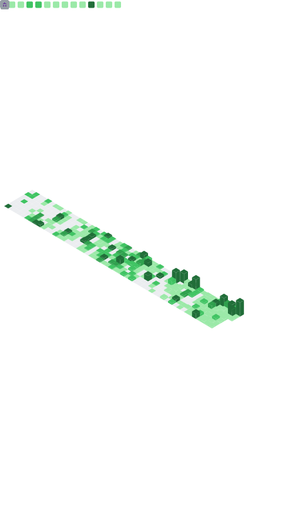

<!-- Auto-generated by generate_readme.py - do not edit README.md directly -->

  

 

## 💻 Tech Stack

 

## 📊 GitHub Stats

  

 

---

## 🚀 What I'm Working On

  <h4>🔹 <a href="https://github.com/dacrab/dacrab">dacrab</a> </h4>
  
🚀 Dynamic GitHub profile README with auto-updating metrics, projects, and con...

  <h4>🔹 <a href="https://github.com/dacrab/cryptoflow">cryptoflow</a> </h4>
  
Real-time crypto dashboard built with SolidJS, TypeScript, and Binance API

  <h4>🔹 <a href="https://github.com/dacrab/ioannislo">ioannislo</a> </h4>
  
Minimalist portfolio for Ioannis Lo - Web Enthusiast & Creative Professional

  <h4>🔹 <a href="https://github.com/dacrab/beauty-salon-scheduling-api">beauty-salon-scheduling-api</a> </h4>
  
Beauty Salon Scheduling API (Laravel 12, Docker, Nginx, SQLite). Endpoints: s...

 

## 🌱 Latest Projects

  <h4>🔹 <a href="https://github.com/dacrab/casa-serena"><strong>casa-serena</strong></a></h4>
  
Luxury beachfront estate website — Astro 5, GSAP, scoped CSS

  
<code>Astro</code>

  <h4>🔹 <a href="https://github.com/dacrab/solid-studio"><strong>solid-studio</strong></a></h4>
  
Modern portfolio/agency website template built with SolidJS, TypeScript, and TailwindCSS

  
<code>TypeScript</code> ⭐ 1

  <h4>🔹 <a href="https://github.com/dacrab/cryptoflow"><strong>cryptoflow</strong></a></h4>
  
Real-time crypto dashboard built with SolidJS, TypeScript, and Binance API

  
<code>TypeScript</code>

 

## 🔨 Recent Contributions

  
❌ <a href="https://github.com/dacrab/cryptoflow/pull/7"><strong>chore: sync bun.lock</strong></a> 
  in <a href="https://github.com/dacrab/cryptoflow">dacrab/cryptoflow</a>

  
❌ <a href="https://github.com/dacrab/ioannislo/pull/24"><strong>chore: sync bun.lock</strong></a> 
  in <a href="https://github.com/dacrab/ioannislo">dacrab/ioannislo</a>

  
❌ <a href="https://github.com/dacrab/clubOS/pull/59"><strong>chore(deps-dev): bump eslint from 9.39.2 to 10.0.1</strong></a> 
  in <a href="https://github.com/dacrab/clubOS">dacrab/clubOS</a>

  
❌ <a href="https://github.com/dacrab/maps-lead-scraper/pull/1"><strong>fix: auto-merge workflow permissions and PR detection</strong></a> 
  in <a href="https://github.com/dacrab/maps-lead-scraper">dacrab/maps-lead-scraper</a>

  
❌ <a href="https://github.com/dacrab/reddit-gallery-dl/pull/6"><strong>fix: auto-merge workflow permissions and PR detection</strong></a> 
  in <a href="https://github.com/dacrab/reddit-gallery-dl">dacrab/reddit-gallery-dl</a>

 

## ⭐ Recently Starred

  
⭐ <a href="https://github.com/EbadShelby/dotfiles"><strong>EbadShelby/dotfiles</strong></a> ⭐ 103 
  Fedora Workstation | Gnome & Niri setup🐧

  
⭐ <a href="https://github.com/abusoww/tuxmate"><strong>abusoww/tuxmate</strong></a> ⭐ 1,737 
  THE MISSING BULK APP INSTALLER FOR LINUX

  
⭐ <a href="https://github.com/Achno/gowall"><strong>Achno/gowall</strong></a> ⭐ 2,032 
  A tool to convert a Wallpaper's color scheme / palette, OCR with VLM's Tradit...

  
⭐ <a href="https://github.com/imputnet/helium-linux"><strong>imputnet/helium-linux</strong></a> ⭐ 580 
  Helium Browser for Linux

  
⭐ <a href="https://github.com/neondatabase/neon"><strong>neondatabase/neon</strong></a> ⭐ 21,140 
  Neon: Serverless Postgres. We separated storage and compute to offer autoscal...

 

---

## 💬 Let's Connect

  

    
  

 

  

