<!-- Auto-generated by generate_readme.py - do not edit README.md directly -->

  <h1 style="margin: 0; font-size: 2.2rem;">
    
    Hey, I'm VKavouras
  </h1>

  <h3>💻 Top Languages</h3>

  <h3>📊 Metrics</h3>

  

---

  <h3>👷 Active projects</h3>

* [dacrab.github.io](https://github.com/dacrab/dacrab.github.io) - A cinematic, high-performance personal portfolio built with Astro, Tailwind C...
* [vicinae](https://github.com/dacrab/vicinae) - A focused launcher for your desktop — native, fast, extensible
* [ioannislo](https://github.com/dacrab/ioannislo) - Minimalist portfolio for Ioannis Lo - Web Enthusiast & Creative Professional

  <h3>🌱 Latest repositories</h3>

* [**email-scraper**](https://github.com/dacrab/email-scraper) - Google Maps email scraper in Python using Playwright; config-driven CSV output; Docker & Railway ready.
* [**clubOS**](https://github.com/dacrab/clubOS) - clubOS built using Svelte(Kit) & Supabase
* [**beauty-salon-scheduling-api**](https://github.com/dacrab/beauty-salon-scheduling-api) - Beauty Salon Scheduling API (Laravel 12, Docker, Nginx, SQLite). Endpoints: slots, book, cancel. Bearer auth. Seeders + tests.

  <h3>🔨 Recent pull requests</h3>

* [feat: add COPR packaging and automation for vicinae](https://github.com/vicinaehq/vicinae/pull/808) on [vicinae](https://github.com/vicinaehq/vicinae)
* [feat: add duplicate link feature](https://github.com/victrme/Bonjourr/pull/728) on [Bonjourr](https://github.com/victrme/Bonjourr)
* [Auto-switch to imperial units based on user locale](https://github.com/victrme/Bonjourr/pull/727) on [Bonjourr](https://github.com/victrme/Bonjourr)
* [Add line break support in quotes for poems and multi-line...](https://github.com/victrme/Bonjourr/pull/726) on [Bonjourr](https://github.com/victrme/Bonjourr)
* [refactor: structure and runes migration](https://github.com/dacrab/clubOS/pull/28) on [clubOS](https://github.com/dacrab/clubOS)

  <h3>⭐ Recent stars</h3>

* [vicinaehq/vicinae](https://github.com/vicinaehq/vicinae) - A focused launcher for your desktop — native, fast, extensible
* [imputnet/helium-linux](https://github.com/imputnet/helium-linux) - Helium Browser for Linux
* [neondatabase/neon](https://github.com/neondatabase/neon) - Neon: Serverless Postgres. We separated storage and compute to offer autoscal...
* [google-gemini/gemini-cli](https://github.com/google-gemini/gemini-cli) - An open-source AI agent that brings the power of Gemini directly into your te...
* [devangshekhawat/Fedora-43-Post-Install-Guide](https://github.com/devangshekhawat/Fedora-43-Post-Install-Guide) - Things to do after installing Fedora 43

  <h3>💬 Connect with me</h3>

  

    
  

