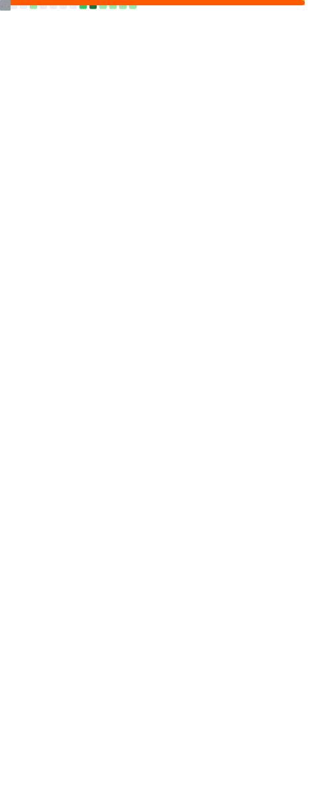

# 👋 Hello, I'm Vaggelis kavouras

---

## 🚀 About Me

> doin my best

- 📍 Based in **Greece**
- 📊 **23** public repositories
- 👥 **15** followers • **5** following
- 🌐 Check out my [website](dacrab.github.io)

---

### 🛠️ Technologies I Use

---

## 📊 GitHub Analytics

<table>
<tr>
<td width="50%">

</td>
<td width="50%">

</td>
</tr>
</table>

---

## 🎯 What I'm currently working on

<!--RECENT_ACTIVITY:start-->
<!--RECENT_ACTIVITY:end-->

---

## ⭐ Recently starred repositories

<!--RECENTLY_STARRED:start-->
<!--RECENTLY_STARRED:end-->

---

## 💼 My Work

### 🚀 Featured Repositories

### [dacrab](https://github.com/dacrab/dacrab)
No description available

**Language:** JavaScript | **Stars:** ⭐ 0 | **Forks:** 🍴 0  
**Topics:** None | **Updated:** 8/20/2025

### [dacrab.github.io](https://github.com/dacrab/dacrab.github.io)
Portfolio built using Astro and LightningCSS

**Language:** Astro | **Stars:** ⭐ 0 | **Forks:** 🍴 0  
**Topics:** None | **Updated:** 8/20/2025

### [clubos](https://github.com/dacrab/clubos)
Custom POS system made using NextJS & Supabase

**Language:** TypeScript | **Stars:** ⭐ 0 | **Forks:** 🍴 0  
**Topics:** None | **Updated:** 8/19/2025

### [craftops](https://github.com/dacrab/craftops)
🛠️ A Go-based automation tool for Minecraft servers, handling mod updates, backups, and maintenance tasks with Discord notifications. Perfect for server admins wanting a hands-off management solution. ✨

**Language:** Go | **Stars:** ⭐ 0 | **Forks:** 🍴 0  
**Topics:** None | **Updated:** 8/19/2025

### [ioannislo](https://github.com/dacrab/ioannislo)
Portfolio for a friend following the brutalistic aeshetic

**Language:** Astro | **Stars:** ⭐ 0 | **Forks:** 🍴 0  
**Topics:** portfolio | **Updated:** 8/19/2025

### [ElysianVista](https://github.com/dacrab/ElysianVista)
No description available

**Language:** TypeScript | **Stars:** ⭐ 0 | **Forks:** 🍴 0  
**Topics:** None | **Updated:** 8/18/2025

---

## ⚡ Recent GitHub Activity

> *Latest contributions and repository updates*

<!--START_SECTION:activity-->
<!--END_SECTION:activity-->

*📊 Activity updates automatically every 6 hours*

---

## 🤝 Let's Connect!

**💬 Open to collaborations and interesting conversations!**

---

## 🎯 3D Contribution Graph

---

---

### ✨ *"Code is poetry written in logic"* ✨

*🕒 This README updates automatically every 6 hours*

⭐ **Star** some repositories if you find them interesting!

